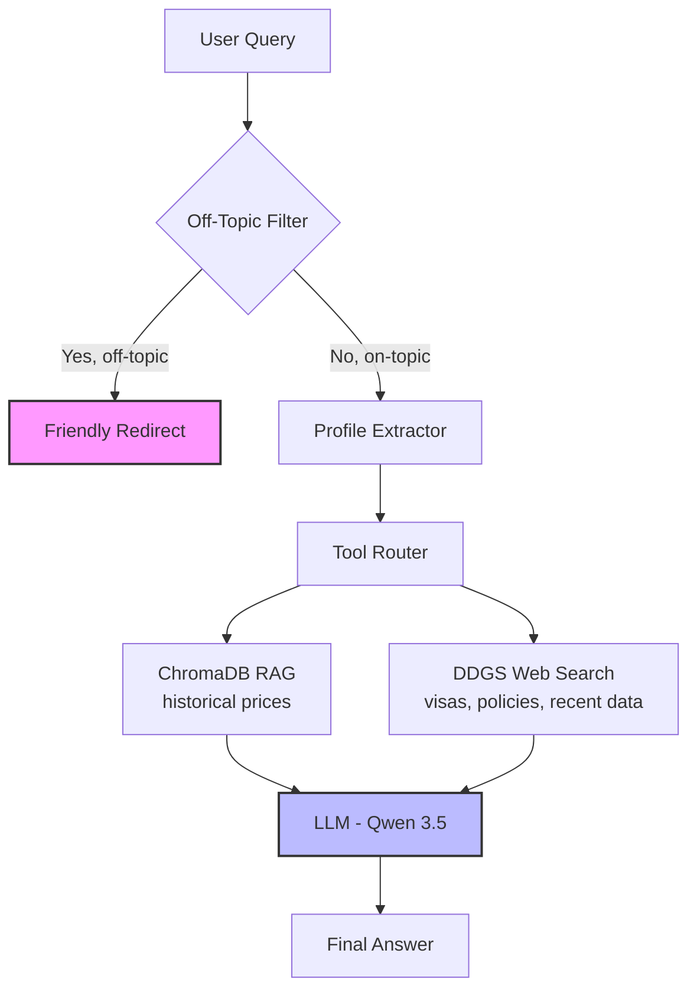

# 🌍 TravelBot: Personalized Relocation Advisor

&gt; **A local LLM-powered agent that helps travelers and remote workers find their ideal destination based on real cost-of-living data, lifestyle preferences, and budget constraints.**

[](https://python.org)
[](LICENSE)
[](https://qwenlm.github.io)
[](https://trychroma.com)

---

## 📋 Table of Contents

- [The Problem](#-the-problem)
- [The Solution](#-the-solution)
- [Key Features](#-key-features)
- [Architecture](#-architecture)
- [Quick Start](#-quick-start)

---

## 🎯 The Problem

Relocating or long-term traveling is a high-stakes decision with thousands of variables: rent, food costs, visa requirements, pet policies, internet quality, safety, and climate. Existing solutions fall short:

| Existing Approach | Limitation |
|-------------------|------------|
| Generic travel blogs | One-size-fits-all, no personalization |
| Cost-of-living calculators | Static data, no lifestyle matching |
| Reddit/forum advice | Unreliable, anecdotal, outdated |
| Commercial relocation services | Expensive, not accessible to nomads |

**The core gap:** There is no free, personalized tool that combines *current* cost data with *individual* lifestyle constraints (budget, pets, remote work needs, family status) to recommend specific destinations.

---

## 💡 The Solution

**TravelBot** is a proof-of-concept for a **local, privacy-first relocation advisor** that:

1. **Understands your profile** — budget, pets, work style, priorities
2. **Queries real cost data** — from structured datasets with inflation adjustments
3. **Searches current information** — visa rules, coworking spaces, pet policies
4. **Reasons transparently** — explains *why* a city fits your specific situation

### Value Proposition

| For | Benefit |
|-----|---------|
| **Digital nomads** | Find affordable, connected, pet-friendly hubs |
| **Remote workers** | Compare real costs vs. salary in different cities |
| **Families** | Filter for schools, safety, healthcare quality |
| **Solo travelers** | Discover budget-friendly destinations matched to interests |

---

## ✨ Key Features

| Feature | Implementation | Status |
|---------|---------------|--------|
| **Local LLM inference** | Qwen 3.5 9B via LM Studio on MacBook M4 | ✅ |
| **Retrieval-Augmented Generation (RAG)** | ChromaDB with sentence-transformer embeddings | ✅ |
| **Multi-source data fusion** | Historical cost data + real-time web search | ✅ |
| **Structured tool calling** | JSON-format agent with forced database lookup | ✅ |
| **Off-topic guardrails** | Keyword filter + prompt-based redirect | ✅ |
| **Inflation-adjusted estimates** | Historical data (2022) adjusted via grocery inflation (2025/2026) | 🔄 |
| **Conversational UI** | Streamlit chat interface with profile sidebar | 🔄 |
| **Multi-city comparison** | Automatic batching of related queries | 🔄 |

---

## 🏗️ Architecture and Data Flow



### Why This Architecture?

| Decision | Rationale |
|----------|-----------|
| **Local LLM (not API)** | Privacy, zero cost, works offline, no rate limits |
| **RAG + Web hybrid** | RAG for structured prices, web for recent/missing data |
| **ChromaDB** | Zero setup, file-based, no cloud dependency |
| **JSON tool calling** | Reliable parsing, works with tool-trained models |
| **Forced tool use** | Prevents hallucination, ensures data-grounded answers |

---

## 🚀 Quick Start

### Prerequisites

- [LM Studio](https://lmstudio.ai) installed
- Python 3.10+

### 1. Install LM Studio & Load Model

```bash
# Download LM Studio from https://lmstudio.ai
# Load Qwen 3.5 9B (or similar tool-capable model)
# Start server: Developer tab → Start Server (default: http://localhost:1234/v1)
git clone https://github.com/V-sety/ods-llm-project.git
cd ods-llm-project

python -m venv venv
source venv/bin/activate  # Windows: venv\Scripts\activate

pip install -r requirements.txt

# Place your Kaggle datasets in ./archive/
# Expected: cost_of_living.csv

python data.py

# Run the cli chat

python chat.py

